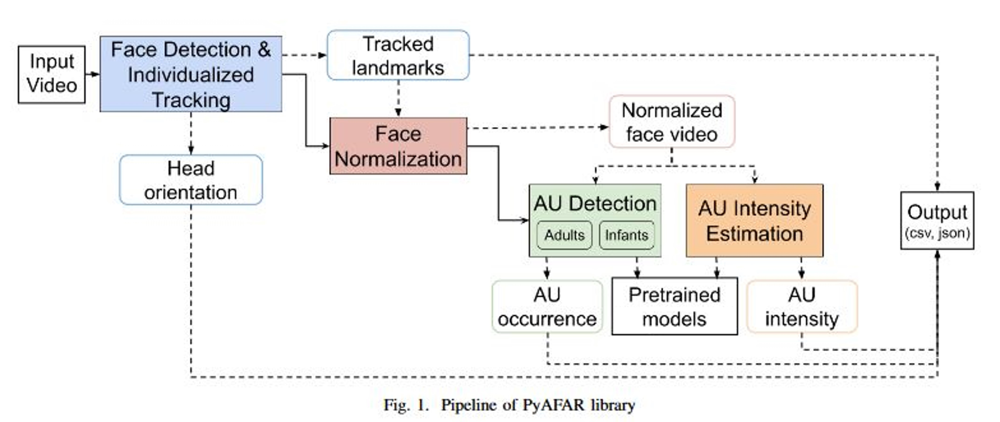

# PyAFAR

PyAFAR is a Python-based, open-source facial action unit detection library for use with adults and infants. For an introduction to PyAFAR and understanding the Facial Affect Coding System (FACS), visit our [website](https://affectanalysisgroup.github.io/PyAFAR/).

PyAFAR comes as an executable file for Windows, Linux (Ubuntu), and Mac platforms. It can be used as an out-of-the-box software with no additional proprietary dependency requirements.

PyAFAR GPU capabilities work only on Linux or WSL2.

## Modules



- `Facial Landmarks, Head Pose and Tracking`: Face detection and landmark prediction is done using the [MediaPipe](https://research.google/pubs/pub48292/) library. Tracking is performed using the [FaceNet](https://www.cv-foundation.org/openaccess/content_cvpr_2015/papers/Schroff_FaceNet_A_Unified_2015_CVPR_paper.pdf). The Perspective-n-Point (PnP) method is used to predict Roll, Pitch and Yaw
- `Face Normalization`: The landmark predictions are used to normalize faces using the [dlib](http://dlib.net/) library.
- `AU predictions`: Normalized faces are used for AU predictions (occurrence and intensity). Separate detection modules for occurrence are available for adults and infants. Intensity predictions are available for adults only.
- `Output`: PyAFAR can output frame-level predictions in CSV and JSON formats to enable easy reading with most platforms used by both computational as well as domain experts.

As MediaPipe retired its support for python 3.7, PyAFAR has disabled person tracking.

### For installation instructions click [here](https://github.com/AffectAnalysisGroup/PyAFAR/wiki/3.-Installation) and how to use click [here](https://github.com/AffectAnalysisGroup/PyAFAR/wiki/4.-How-to-use).

## Citations

PyAFAR is a result of the following publications. If you use PyAFAR in your work, cite our following contributions:


**Pipeline**
```
@inproceedings{hindujapyafar,
  title={PyAFAR: Python-based Automated Facial Action Recognition library for use in Infants and Adults},
  author={Hinduja, Saurabh and Ertugrul, Itir Onal and Bilalpur, Maneesh and Messinger, Daniel S and Cohn, Jeffrey F},
  booktitle={International Conference on Affective Computing and Intelligent Interaction},
  year={2023},
  organization={IEEE}
}
```
If you are using our *Infant* AU detector, in addition to the `pipeline` work also cite:
```
@inproceedings{ertugrulpyafar,
  title={Expanding PyAFAR: A Novel Privacy-Preserving Infant AU Detector},
  author={Ertugrul, Itir Onal and Hinduja, Saurabh and Bilalpur, Maneesh and Messinger, Daniel S and Cohn, Jeffrey F},
  booktitle={International Conference on Automatic Face and Gesture Recognition},
  year={2024},
  organization={IEEE}
}
```

## Acknowledgements
The development of PyAFAR was supported in part by NIH awards R01MH096951, R01GM105004, and UH3NS100549.

## License

Copyright (c) 2024 AffectAnalysisGroup.

AFAR is freely available for free non-commercial use, and may be redistributed under these conditions. Interested in a commercial license? Please contact <a href="https://www.jeffcohn.net/">Jeffrey Cohn</a>.

See complete license information [here](https://github.com/AffectAnalysisGroup/PyAFAR/blob/main/LICENSE).
