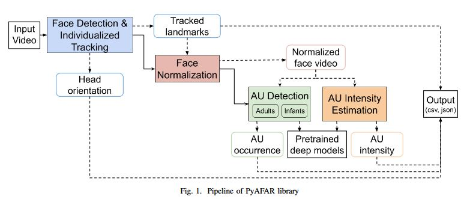

# PyAFAR

PyAFAR is a Python-based, open-source facial action unit detection library for use with adults and infants. For an introduction to PyAFAR and understanding the Facial Affect Coding System (FACS), visit our [website](https://affectanalysisgroup.github.io/PyAFAR/).

## Requirements

PyAFAR comes as an executable file for Windows, Linux (Ubuntu), and Mac platforms. It can be used as an out-of-the-box software with no additional dependency requirements.

PyAFAR GPU capabilities work only on Linux or WSL2.

## Modules



- `Facial Landmarks, Head Pose and Tracking`: Face detection and landmark prediction is done using the [MediaPipe](https://research.google/pubs/pub48292/) library. Tracking is performed using the [FaceNet](https://www.cv-foundation.org/openaccess/content_cvpr_2015/papers/Schroff_FaceNet_A_Unified_2015_CVPR_paper.pdf). The Perspective-n-Point (PnP) method is used to predict Roll, Pitch and Yaw
- `Face Normalization`: The landmark predictions are used to normalize faces using the [dlib](http://dlib.net/) library.
- `AU predictions`: Normalized faces are used for AU predictions (occurrence and intensity). Separate detection modules for occurrence are available for adults and infants. Intensity predictions are available for adults only.
- `Output`: PyAFAR can output frame-level predictions in CSV and JSON formats to enable easy reading with most platforms used by both computational as well as domain experts.

## How to run

A step-by-step instruction guide with screenshots on how to run PyAFAR can be found [here](./resources/readme/instructions.md).

Ensure the executable file (.exe file in windows) and the downloaded models folder are in the same directory for the package to run.

## Output format

A complete description of each variable in the output can be found [here](./resources/readme/output_format.md).

## Citations

PyAFAR is a result of the following publications. If you use PyAFAR in your work, cite our following contributions:


**Pipeline**
```
@inproceedings{hindujapyafar,
  title={PyAFAR: Python-based Automated Facial Action Recognition library for use in Infants and Adults},
  author={Hinduja, Saurabh and Ertugrul, Itir Onal and Bilalpur, Maneesh and Messinger, Daniel S and Cohn, Jeffrey F},
  booktitle={International Conference on Affective Computing and Intelligent Interaction},
  year={2023},
  organization={IEEE}
}
```
**Infant AU detector**

```
@inproceedings{ertugrulpyafar,
  title={Expanding PyAFAR: A Novel Privacy-Preserving Infant AU Detector},
  author={Ertugrul, Itir Onal and Hinduja, Saurabh and Bilalpur, Maneesh and Messinger, Daniel S and Cohn, Jeffrey F},
  booktitle={International Conference on Automatic Face and Gesture Recognition},
  year={2024},
  organization={IEEE}
}

@article{onal2023infant,
  title={Infant AFAR: Automated facial action recognition in infants},
  author={Onal Ertugrul, Itir and Ahn, Yeojin Amy and Bilalpur, Maneesh and Messinger, Daniel S and Speltz, Matthew L and Cohn, Jeffrey F},
  journal={Behavior research methods},
  volume={55},
  number={3},
  pages={1024--1035},
  year={2023},
  publisher={Springer}
}
```

## MIT License

Copyright (c) 2024 AffectAnalysisGroup

Permission is hereby granted, free of charge, to any person obtaining a copy of this software and associated documentation files (the "Software"), to deal in the Software without restriction, including without limitation the rights to use, copy, modify, merge, publish, distribute, sublicense, and/or sell copies of the Software, and to permit persons to whom the Software is furnished to do so, subject to the following conditions:

The above copyright notice and this permission notice shall be included in all copies or substantial portions of the Software.

THE SOFTWARE IS PROVIDED "AS IS", WITHOUT WARRANTY OF ANY KIND, EXPRESS OR IMPLIED, INCLUDING BUT NOT LIMITED TO THE WARRANTIES OF MERCHANTABILITY, FITNESS FOR A PARTICULAR PURPOSE AND NONINFRINGEMENT. IN NO EVENT SHALL THE AUTHORS OR COPYRIGHT HOLDERS BE LIABLE FOR ANY CLAIM, DAMAGES OR OTHER LIABILITY, WHETHER IN AN ACTION OF CONTRACT, TORT OR OTHERWISE, ARISING FROM, OUT OF OR IN CONNECTION WITH THE SOFTWARE OR THE USE OR OTHER DEALINGS IN THE SOFTWARE.
