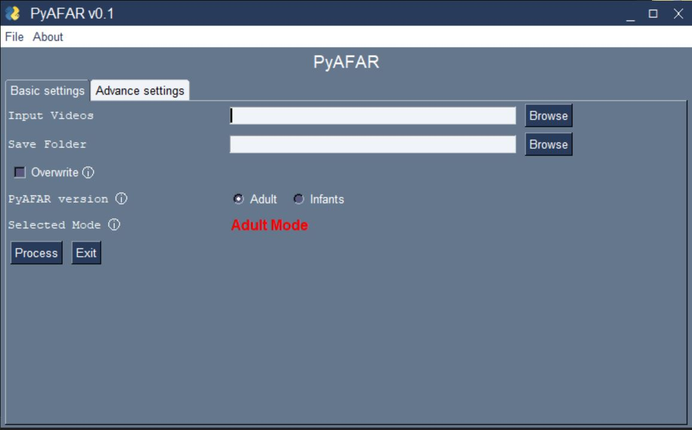
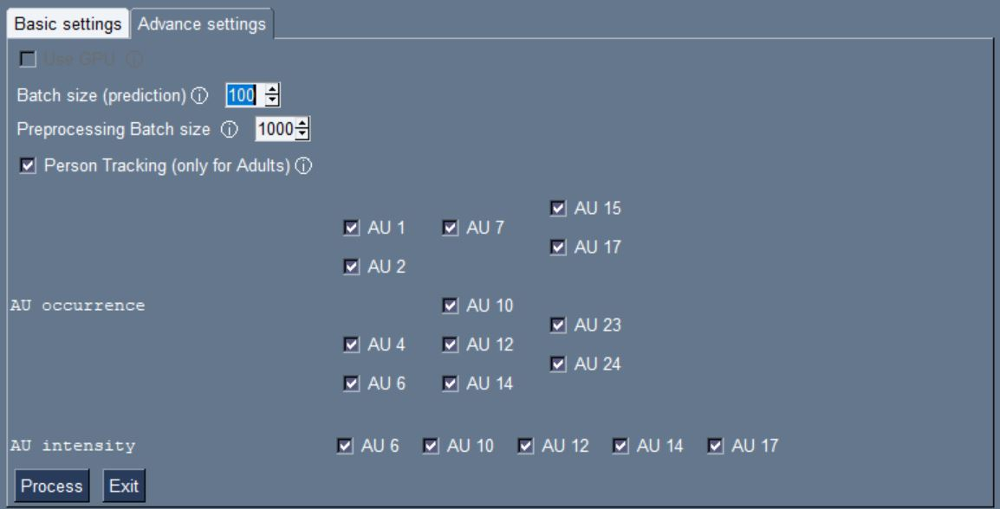

## Running PyAFAR

PyAFAR has two settings--basic and advanced to obtain landmarks, head pose and action unit predictions.

### Basic settings

These are necessary settings that include path to videos to process, save and other information.

- `Input Videos`: path to the folder containing videos that need to be processed. 
- `Save Folder`: path to save output from PyAFAR for the input videos
- `Browse` button enables browsing and selecting the folders interactively
- `PyAFAR version`: Since adult and infant AU predictions are from different set of models, choose the appropriate one using the radio button.

### Advanced settings

- `Use GPU`: GPUs enable faster AU predictions. If your machine has a GPU that you wish to use, enable this.
- `Batch size`: The batch size for AU predictions. Larger GPUs memory can accommodate higher batch size.
- `Preprocessing size`:
- `Person Tracking`: 
- `AU occurrence`: Choice of occurrence predictions required from the Input Videos.
- `AU intensity`: Choice of intensity predictions required from the Input Videos.